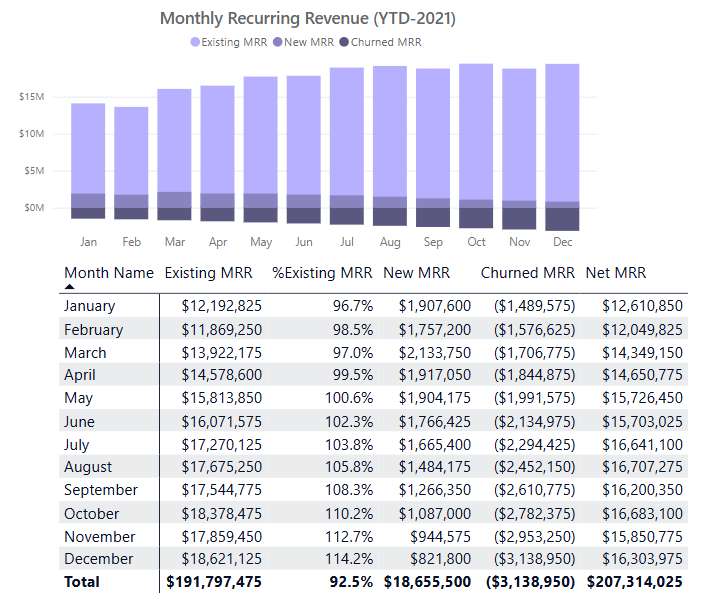
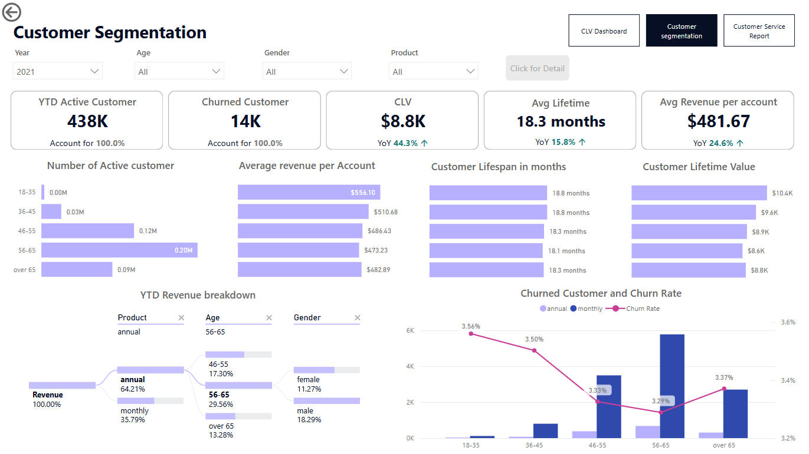
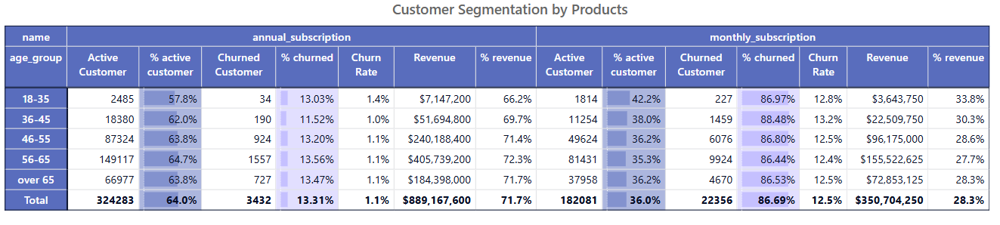

# Project Background
Established in 2017, our subscription-based financial advisory service offers newsletters, webinars, and investment recommendations. We also provide daytime support for customer inquiries related to products, signups, and cancellations. As a data analyst at the company, I focus on monitoring key metrics like customer lifetime value (CLV), recurring revenue, and churn rate to maximize long-term value and growth potential. This dashboard aims to provide accurate and actionable insights to help achieve these objectives.

Objectives and insights are provided on the following key areas:

- **Category 1:** Manage and monitor customer lifetime value to maximize company long-term value
- **Category 2:** Investigate customer behaviour 
- **Category 3:** Call/Support center activities to further 

The document for Python code to explore, clean and transform data can be found here [link].

Targed SQL queries regarding various business questions can be found here [link].

An interactive Power BI dashboard used to report and explore sales trends can be found here [link].

# Data Structure & Initial Checks

The original dataset contains four tables: **customer_info**, **product_info**, **customer_product**, and **customer_case**. To achieve the project's objectives, I generated a new table, **transactions_table**, using Python, to calculate metrics such as Monthly Recurring Revenue (MRR). The tables are described as follows:

- **customer_info**: Contains customer information such as gender and age, with each customer identified by a unique `customer_id`. This table includes over 508,000 rows representing unique customers.
- **product_info**: Provides information on subscription plans offered by the company, including pricing and payment cycles.
- **customer_product**: Contains `customer_id` and their chosen subscription plan, along with signup and cancellation dates. It is important to note that each row is unique for a `customer_id`.
- **customer_case**: Documents call center data, with each row representing a unique case (`case_id`). This table includes the customer who made the call, the contact channel (phone or email), and the reason for the call.
- **transactions_table** (enriched table): Each transaction is documented by a row for every payment made. This table includes transaction date, signup and cancellation dates, transaction amount, the associated plan/product, and its payment cycle.
- **Calendar** (Common date table): A common date table is created in Power BI Query to aid in time-series metric calculation. 

# Executive Summary

### Overview of Findings

Our subscription service demonstrates robust growth, evidenced by a ***40.5% year-over-year increase at the end of 2021***. Monthly recurring revenue shows highly-stable growth driven by well-managed monthly customer base. This signals strong market fit and effective acquisition strategies. Our ***3.33% churn rate***, which has surged by 46.8% compared to 2020, signals an urgent need to bolster our customer retention efforts. Identifying churn drivers is crucial for sustainable growth. Despite overall positive trends, ***the average customer lifespan of 18.3 months***, although improve by 15.8% YoY, indicates an opportunity to improve customer retention strategy, especially within our large base of monthly subscribers.

# Insights Deep Dive
### Category 1: Customer liftime value insights (in 2021 as an instant)

* **1.** *The overall YTD MRR shows generally positive trend* through out the year, ***increasing from 12.21ml from January to 16.3ml December***. The “Existing” MRR is the largest contributor (up to 92.5% when consider total Net recurring revenue of 2021) to the total MRR and shows a consistent upward trend throughout the year. Churned MRR is calculated to be a rolling sum of churned customer since the beginning of the period, the effect of rolling MRR is obvious in February or November since it deminized the growth of Net MRR. Additionally, New MRR contributions decrease in the latter half (*starting in June with 1.7ml to December 0.8ml*) , suggesting potential challenges in acquiring new customers and sustaining existing ones. 

  
* **2.** Customer Lifetime Value Chart suggests that the current subscriber based is generating good value over time with the total of ***$8.8K for a whole year 2021***, ***YoY increase is 44.3%***, which is very significant. There are seemingly a downward trend from January to July-2021 and a upward trend begin from August to the end of the year mirroring a gradual rise in average customer lifetime.. However, the fluctuations are too minor to point out a seasonal change.  
* A large majority of customers are on monthly plans.  The 10-12 month lifespan segment has the highest concentration of monthly subscribers (149K), significantly more than any other segment.  Conversely, annual subscribers are most prevalent in the over 15 months segment (64K), indicating longer retention for annual plans. This suggests that while customer retention for monthly plans may fluctuate, overall customer value and lifespan are steadily improving, particularly for annual subscribers.

* **3.** *The overall number of churned customers have a increased tendency during the year* (rising from 894 customers in January to 1498 in December). This escalating churn count is mirrored by a fluctuating, yet ultimately increasing churn rate, which began the year at 0.90% and peaked at 1.02% in December. Specifically, the period from September to December shows a substantial increase in both churned customers and the churn rate. Churned customers jumped from 1,189 in September to 1,426 in December, while the churn rate rose from 0.89% to 1.01% during the same period. As expected, *monthly subscribers constituted the vast majority of churned customers* each month, given the shorter subscription cycle. Annual subscribers have a tendency to churned less untill the end of the year, indicating a better retention in annual customers. 

### Category 2: Analysis of Customer Behavior and CLV Drivers

* **1. The 18-35 age group is a high-value, low-volume segment and the 46-65 age groups are high-volume, steady-growth segments.**
  - *The 56-65 age group has the highest number of active customers*, followed by the over 65 group, while the younger age groups (18-35 and 36-45) have significantly fewer customers. The churn rate is also highest for the youngest age group (18-35) at 3.56%, followed by the 36-45 age group at 3.5%. The older age groups have lower churn rates, (56-65 group at 3.29%).
  - Despite this, *the ***18-35 group*** has the highest CLV at* ***$10.4K***, followed by 36-45 at $9.6K. Older groups have CLV values of 46-55 at $8.9K, 56-65 at $8.6K, and over 65 at $8.8K. *Subscription duration is highest for the 18-35 group at* ***18.8 months***, while the 56-65 group, despite having the most active accounts, subscribes for an average of 18.1 months. This indicates that the 18-35 group are highly valuable customers and a prime target for retention effort.

  - The above reviews that the company's products or services are more appealing to older age groups. It could be due to factors like product relevance, marketing targeting, or brand perception. While the younger customers are less loyal or have different needs and preferences compared to older customers, this could be due to factors like changing lifestyles, budget constraints, or a preference for newer trends and technologies.

* **2. Analyzing subscription choices: annual plans are overall preferred with lower churned rate.**
  - In 2021, the ratio between monthly and annual subscriptions remained stable. Older age groups (over 35) preferred annual plans (62.5%-63.3%), while the 18-35 group had only 56.1% annual subscriptions. Conversely, monthly subscriptions were more popular among the younger group, with 43.9%. Despite fewer monthly subscribers overall, they had a higher churn rate, making up 89.5%-92.2% of churned customers across age groups.

* **3. The segmentations seemed not to changed much over the last 5 years.**
  - Both CLV and customer activity show a consistent upward trend across all age groups from 2017 to 2021. The 18-35 age group exhibits highest CLV across all years (growing from $607.9 in 2017 to $9,459.7 in 2021), significantly outpacing other age segments. However, they have fewest active customers (from 310 in 2017 to 3,680 end of 2021). The 46-65 age groups are high-volume, steady-growth segments while .  

### Category 3:

* **Main insight 1.** More detail about the supporting analysis about this insight, including time frames, quantitative values, and observations about trends.
  
* **Main insight 2.** More detail about the supporting analysis about this insight, including time frames, quantitative values, and observations about trends.
  
* **Main insight 3.** More detail about the supporting analysis about this insight, including time frames, quantitative values, and observations about trends.
  
* **Main insight 4.** More detail about the supporting analysis about this insight, including time frames, quantitative values, and observations about trends.

[Visualization specific to category 3]

### Category 4:

* **Main insight 1.** More detail about the supporting analysis about this insight, including time frames, quantitative values, and observations about trends.
  
* **Main insight 2.** More detail about the supporting analysis about this insight, including time frames, quantitative values, and observations about trends.
  
* **Main insight 3.** More detail about the supporting analysis about this insight, including time frames, quantitative values, and observations about trends.
  
* **Main insight 4.** More detail about the supporting analysis about this insight, including time frames, quantitative values, and observations about trends.

[Visualization specific to category 4]

# Recommendations:

Based on the insights and findings above, we would recommend the [stakeholder team] to consider the following: 

* Specific observation that is related to a recommended action. **Recommendation or general guidance based on this observation.**
  
* Specific observation that is related to a recommended action. **Recommendation or general guidance based on this observation.**
  
* Specific observation that is related to a recommended action. **Recommendation or general guidance based on this observation.**
  
* Specific observation that is related to a recommended action. **Recommendation or general guidance based on this observation.**
  
* Specific observation that is related to a recommended action. **Recommendation or general guidance based on this observation.**
  

# Assumptions and Caveats:

Throughout the analysis, multiple assumptions were made to manage challenges with the data. These assumptions and caveats are noted below:

* Assumption 1 (ex: missing country records were for customers based in the US, and were re-coded to be US citizens)
  
* Assumption 1 (ex: data for December 2021 was missing - this was imputed using a combination of historical trends and December 2020 data)
  
* Assumption 1 (ex: because 3% of the refund date column contained non-sensical dates, these were excluded from the analysis)
